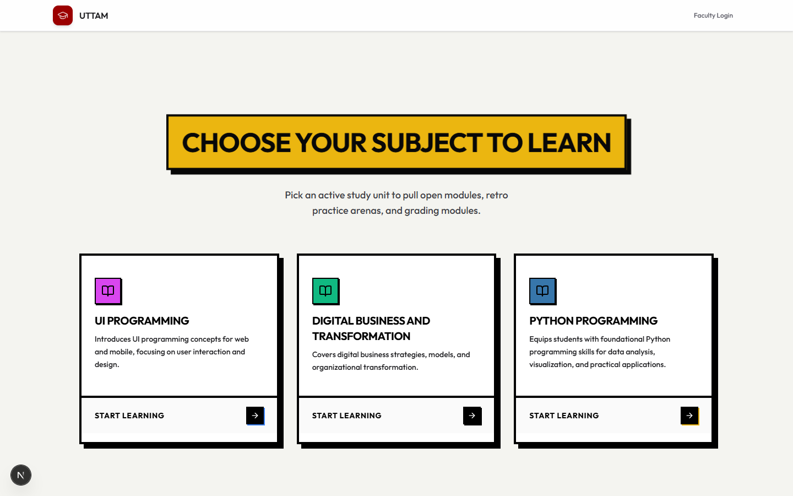
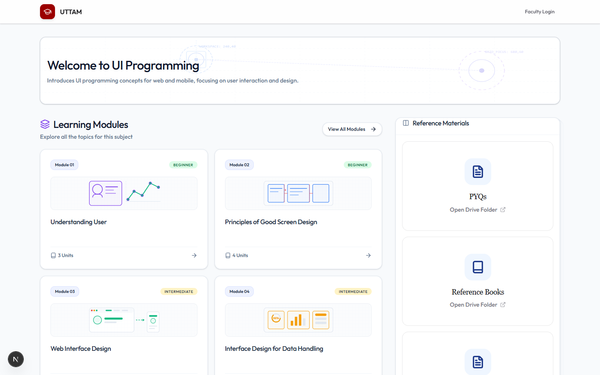
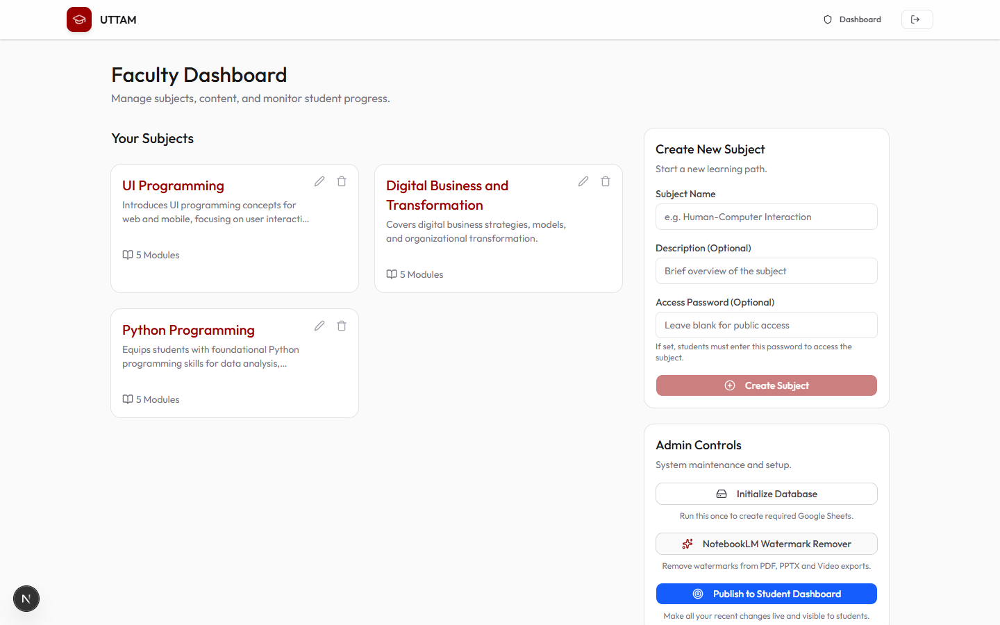
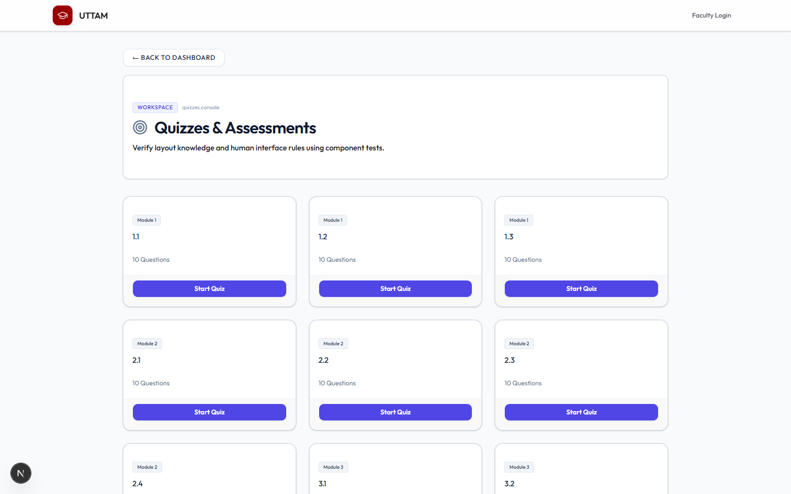
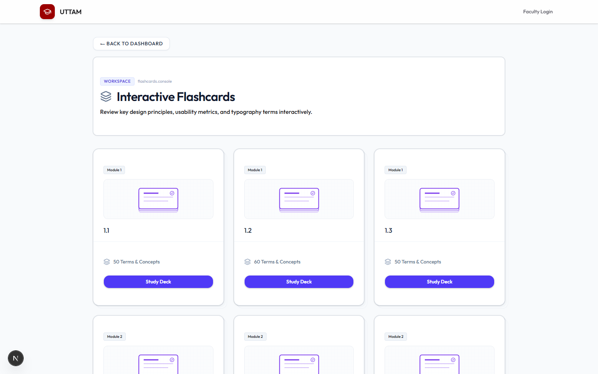
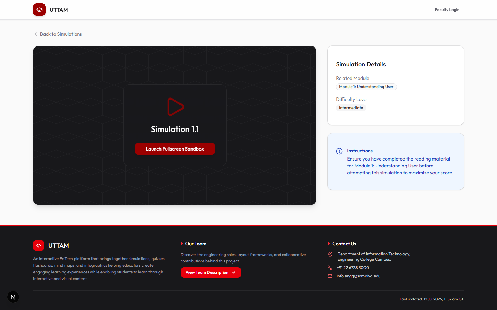
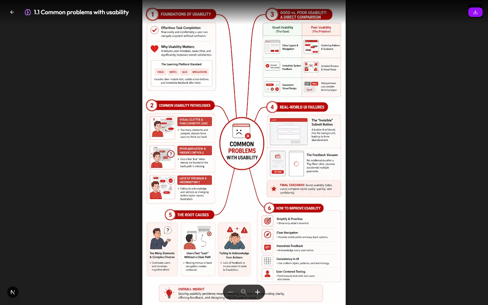
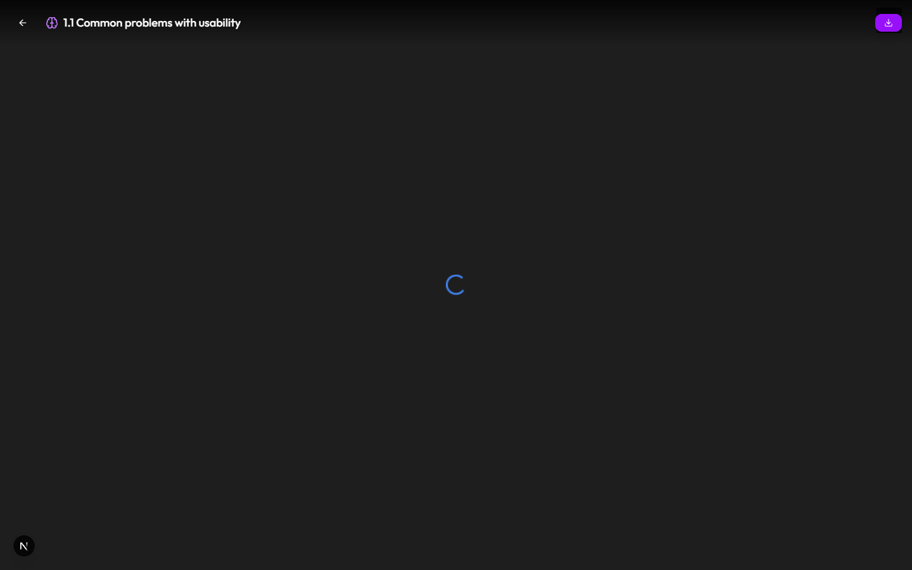
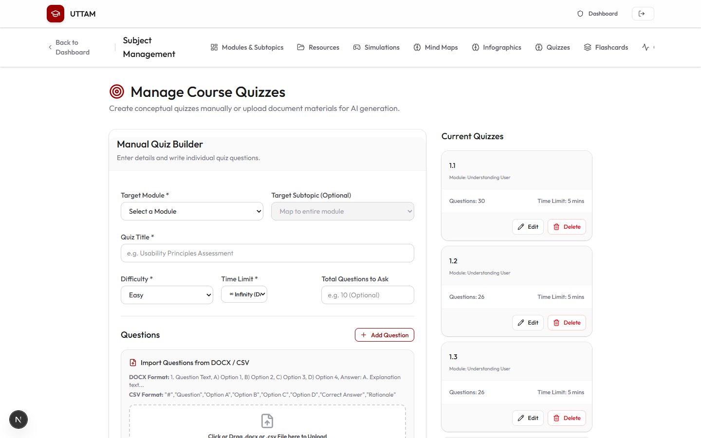
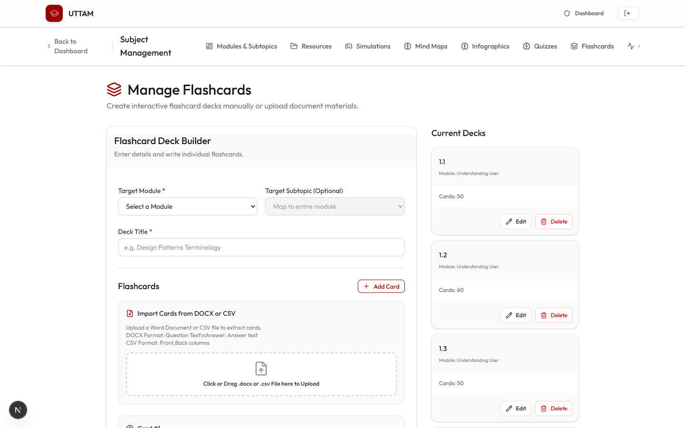

<div align="center">

# 🎓 UTTAM

### A modern educational platform for creating, managing, and delivering interactive learning content.


</div>

---

# 📖 Overview

The **UTTAM** is a modern web application that enables faculty members to create, manage, and publish interactive educational content through a centralized dashboard.

The platform combines structured learning modules with interactive educational tools such as quizzes, flashcards, simulations, mind maps, infographics, rich notes, and multimedia resources, providing students with an engaging and organized learning experience.

The application follows a lightweight static-content architecture, allowing content to be managed efficiently while delivering a fast and responsive student experience through GitHub Pages.

---

# ✨ Features

## 👨‍🎓 Student Portal

- 📚 Subject Dashboard
- 📖 Structured Learning Modules
- 📝 Rich Learning Notes
- 💡 Did You Know Sections
- 🎥 Video Learning
- 🎧 Audio Learning
- 📝 Interactive Quizzes
- 🧠 Flashcards
- 🗺 Mind Maps
- 🖼 Infographics
- 🎮 Educational Simulations
- 📄 Learning Resources
- 👥 Meet the Team Directory

---

## 👨‍🏫 Faculty Portal

- Subject Management
- Module Management
- Text Content Editor
- Quiz Management
- Flashcard Management
- Simulation Management
- Mind Map Management
- Infographic Management
- Resource Management
- Multimedia Management
- Content Matrix
- One-click Publish to Student Dashboard

---

# 🚀 Interactive Learning Tools

- Interactive Quiz Engine
- Flashcard Learning
- Educational Simulations
- Mind Map Viewer
- Rich Notes
- Did You Know Content (with Embedded Media)
- Infographic Viewer
- Multimedia Learning
- PDF Learning Resources

---

# 🏗 System Architecture

```text
Faculty Dashboard
        │
        ▼
Google Apps Script
        │
        ▼
Google Sheets
        │
        ▼
Publish to Student Dashboard
        │
        ▼
Generate static data.json
        │
        ▼
GitHub Pages
        │
        ▼
Students
```

---

# ⚡ Key Highlights

- Lightweight client-side architecture
- Fast static content delivery
- Centralized faculty content management
- Interactive educational resources
- Responsive user interface
- Zero-cost deployment using GitHub Pages
- Google Sheets powered content management
- Easy content publishing workflow

---

# 🛠 Technology Stack

| Category | Technology |
|----------|------------|
| Framework | Next.js 16 |
| Frontend | React 19 |
| Language | TypeScript |
| Styling | Tailwind CSS 4 |
| UI Components | shadcn/ui |
| Animation | Framer Motion |
| Icons | Lucide React |
| Backend | Google Apps Script |
| Content Storage | Google Sheets |
| Media Storage | Google Drive |
| Deployment | GitHub Pages |
| Automation | GitHub Actions |

---

# 📂 Project Structure

```text
src/
│
├── app/
│   ├── student/
│   └── faculty/
│
├── components/
│   ├── Quiz/
│   ├── cards/
│   ├── layout/
│   ├── student/
│   ├── faculty/
│   └── ui/
│
├── data/
├── lib/
├── hooks/
├── types/
└── utils/

public/
scripts/
documentation/
```

---

# 🎯 Core Modules

## 📚 Learning Modules

Structured educational content divided into modules, topics, and subtopics.

---

## 📝 Rich Notes

Comprehensive learning notes with formatted educational content.

---

## 💡 Did You Know

Interesting facts and additional learning insights integrated within modules.

---

## 🎥 Multimedia Learning

Embedded video and audio resources supporting interactive learning.

---

## 📝 Interactive Quizzes

- Multiple Choice Questions
- Instant Feedback
- Interactive Learning Experience

---

## 🧠 Flashcards

Interactive flashcards for revision and concept reinforcement.

---

## 🗺 Mind Maps

Visual concept organization for improved understanding.

---

## 🖼 Infographics

Graphical educational summaries for quick revision.

---

## 🎮 Educational Simulations

Interactive simulations providing hands-on learning experiences.

---

## 📄 Learning Resources

Access to PDFs, documents, presentations, and additional learning material.

---

# ⚡ Installation

For installation instructions, please refer to:

`documentation/installation_guide.md`

---

# 📸 Screenshots

### Home Page



---

### Student Dashboard



---

### Faculty Dashboard



---

### Quiz Interface




---

### Flashcards




---

### Simulation



---

### Mind Maps



---

### Infographics



---

### Faculty Quiz Creation



---

### Faculty Flashcard Creation



---

# 🎯 Design Philosophy

This platform is designed as a lightweight educational content delivery system that enables faculty members to efficiently organize and publish interactive learning resources while providing students with a fast, responsive, and engaging learning experience.

The focus is on simplicity, maintainability, centralized content management, and interactive educational delivery using a modern web technology stack.

---
