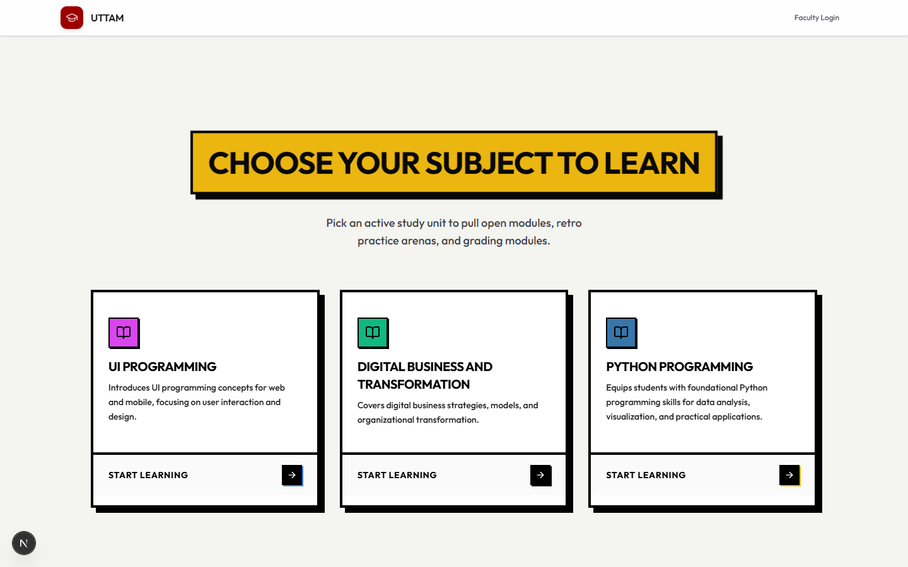
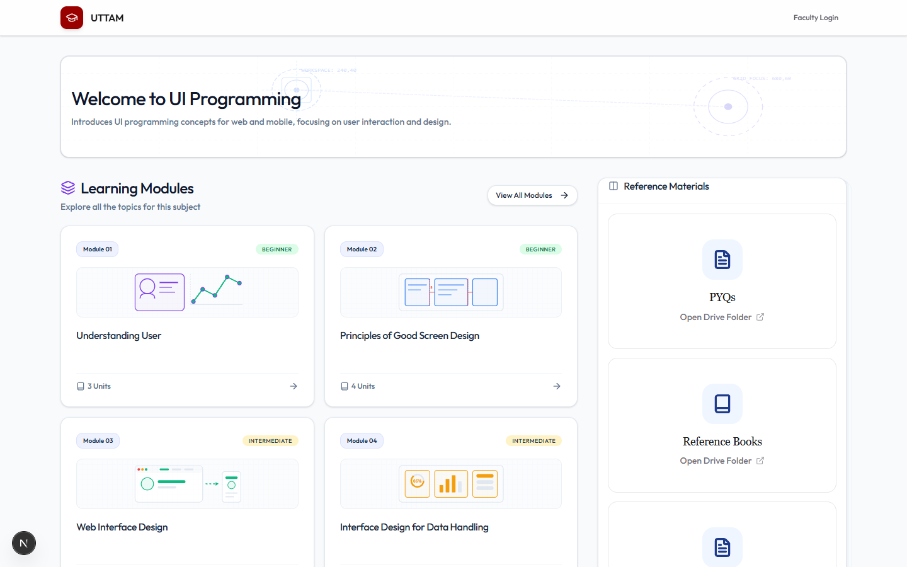
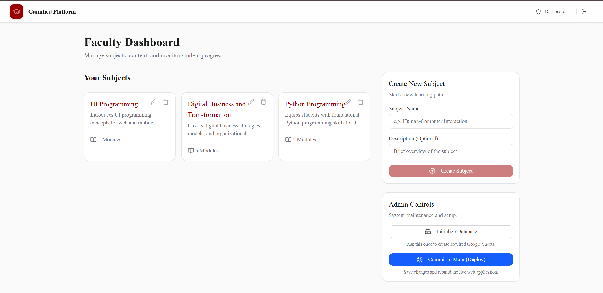
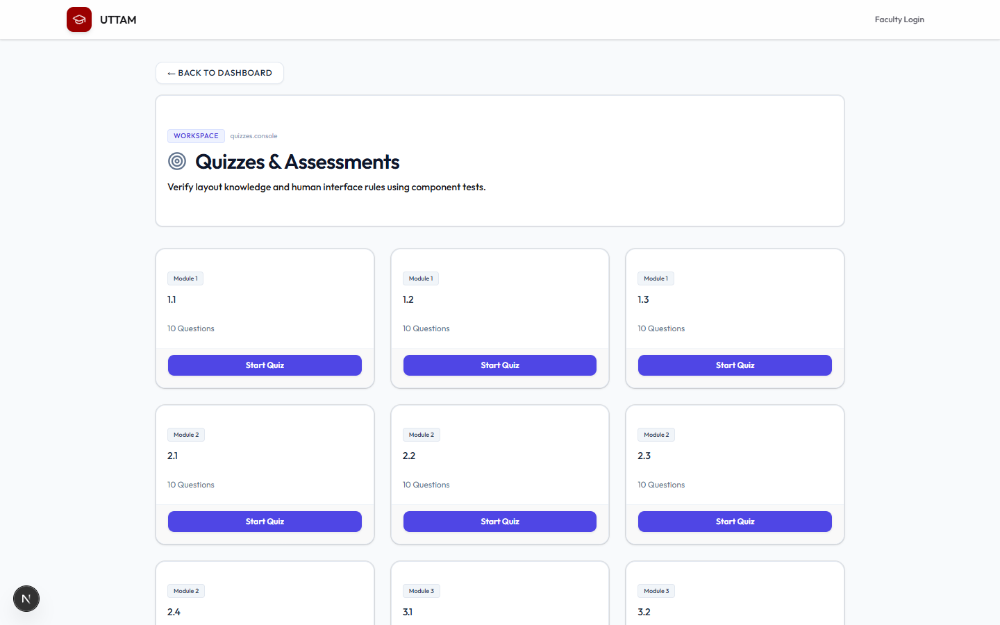
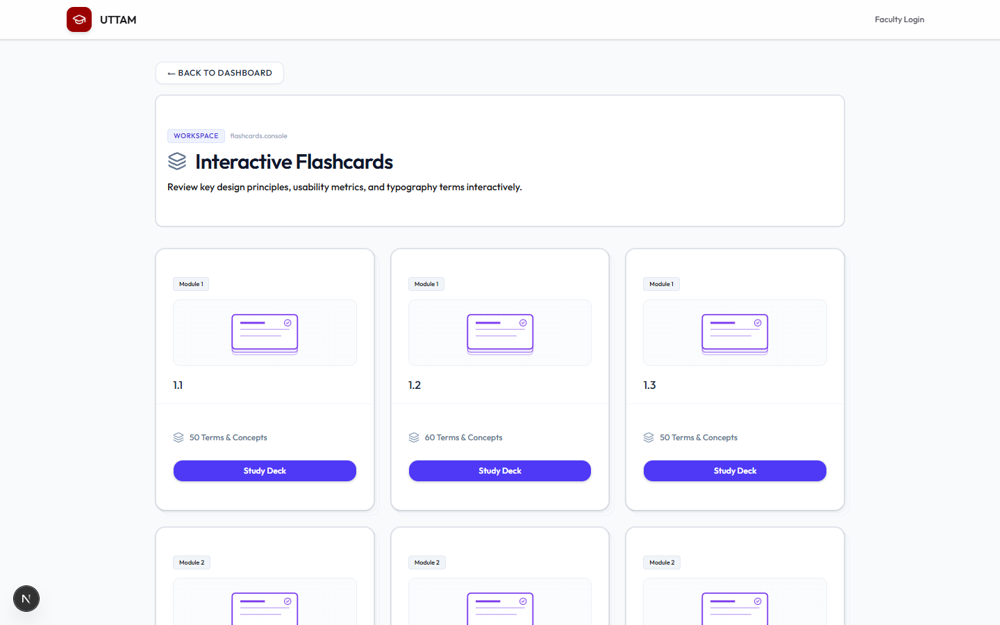
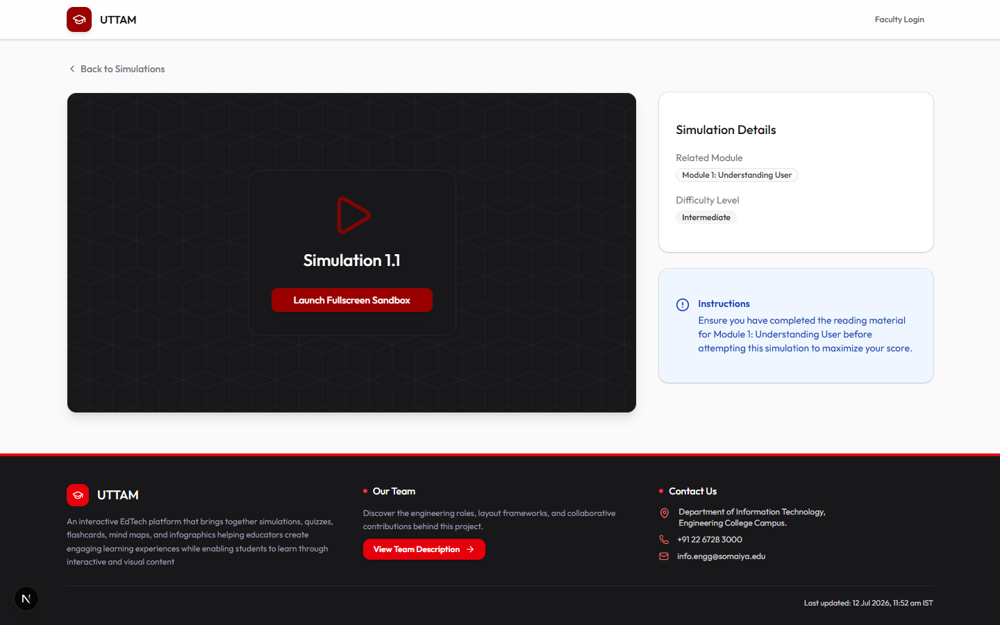
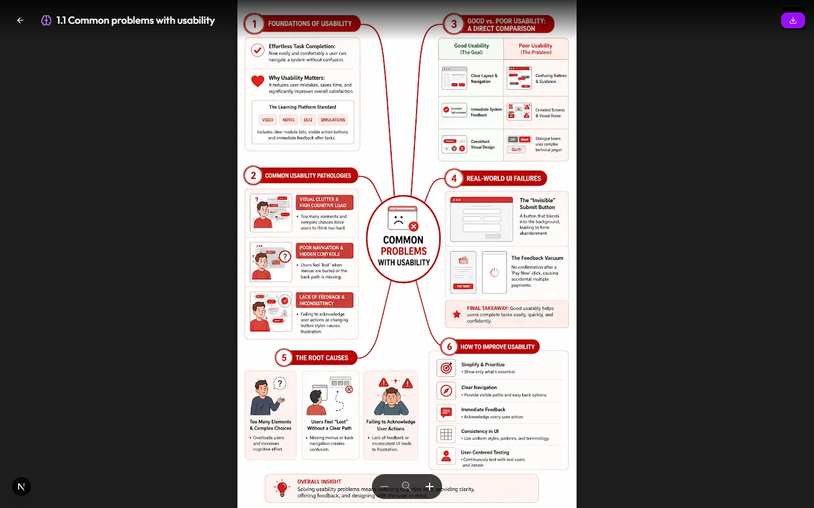
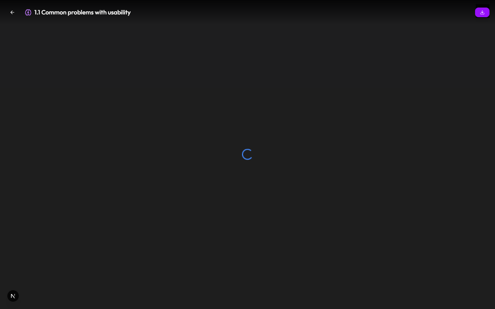
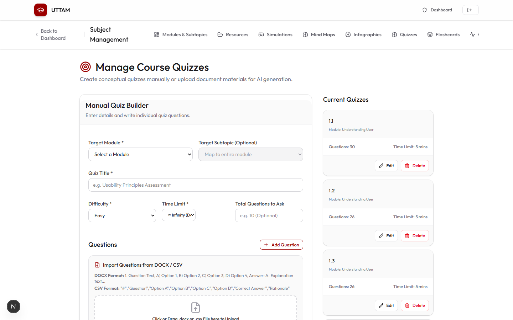
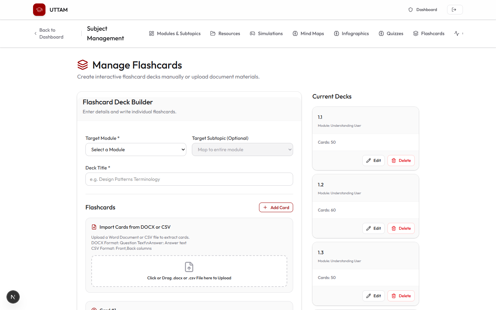

<div align="center">

# 🎓 UTTAM

### A Modern Interactive Learning Management Platform

*A next-generation educational platform that empowers faculty to create, manage, and publish interactive learning experiences while providing students with an engaging, organized, and responsive digital classroom.*


<br>



### **Learn • Practice • Visualize • Revise • Publish**

*A complete ecosystem for modern digital education.*

</div>

---

# 📖 Overview

**UTTAM** is a modern educational platform designed to simplify the creation, organization, management, and delivery of interactive academic content.

Unlike conventional Learning Management Systems that primarily focus on distributing files, UTTAM integrates structured learning with interactive educational experiences. Faculty members can create, organize, and publish complete subjects through a centralized dashboard, while students access an intuitive learning environment containing rich notes, multimedia resources, quizzes, flashcards, mind maps, simulations, infographics, and downloadable learning materials.

The platform follows a lightweight static-content architecture powered by **Google Apps Script**, **Google Sheets**, and **GitHub Pages**, enabling centralized content management, secure publishing workflows, responsive performance, and zero-cost deployment.

---

# 🌟 Why UTTAM?

Learning becomes significantly more effective when students can **study, practice, visualize, and revise** within a single platform instead of switching between multiple tools.

UTTAM brings together structured educational content and interactive learning resources into one unified ecosystem, allowing institutions to efficiently manage academic content while providing students with an engaging, distraction-free learning experience.

### Key Benefits

- 📚 Structured and organized learning
- 🧠 Active recall through interactive learning
- 🎮 Hands-on educational experiences
- 🎥 Integrated multimedia learning
- ⚡ Fast static content delivery
- 📱 Responsive across all devices
- ☁ Zero-cost cloud deployment
- 👨‍🏫 Centralized faculty management

---

# ✨ Features

## 👨‍🎓 Student Portal

The Student Portal provides a clean and intuitive learning environment where students can seamlessly navigate through subjects, modules, and interactive educational resources.

Students can:

- Browse structured subjects and learning modules
- Read rich educational notes
- Explore "Did You Know" knowledge snippets
- Watch educational videos
- Listen to topic-specific audio lectures
- Attempt interactive quizzes
- Revise using flashcards
- Understand concepts through mind maps
- Learn visually with infographics
- Practice using educational simulations
- Access downloadable learning resources
- Explore the Meet the Team directory

<p align="center">

</p>

---

## 👨‍🏫 Faculty Portal

The Faculty Portal centralizes the entire educational content creation workflow, allowing instructors to efficiently manage, organize, and publish interactive learning material from a single dashboard.

Faculty members can:

- Create and manage subjects
- Organize modules and topics
- Create rich educational notes
- Manage quizzes and flashcards
- Upload simulations
- Manage mind maps and infographics
- Upload videos, audio, and learning resources
- Control student visibility
- Manage curriculum using the Content Matrix
- Publish updates to the Student Portal with a single click

<p align="center">

</p>

---

# 🚀 Interactive Learning Experience

UTTAM encourages active learning by integrating multiple educational techniques within every module. Instead of separating study material from practice and revision, students can transition naturally between different learning resources while staying focused on the same topic.

## 📝 Interactive Quizzes

Students can evaluate their understanding through interactive quizzes that provide immediate feedback and reinforce conceptual learning.

| Quiz Dashboard | Quiz Attempt |
|:--------------:|:------------:|
|  |  |

---

## 🧠 Flashcards

Flashcards support active recall and long-term memory retention by allowing students to quickly revise important concepts through an intuitive card-based interface.

| Flashcards | Flashcard View |
|:----------:|:--------------:|
|  |  |

---

## 🎮 Educational Simulations

Interactive simulations transform theoretical concepts into practical learning experiences, helping students visualize ideas that are difficult to understand through text alone.

<p align="center">

</p>

---

## 🗺 Mind Maps

Mind Maps provide visual representations of complex topics, enabling students to understand relationships between concepts and revise entire modules efficiently.

<p align="center">

</p>

---

## 🖼 Educational Infographics

Infographics summarize educational content through engaging visual designs, making revision faster and improving concept retention.

<p align="center">

</p>

---
# 🏗 System Architecture

UTTAM follows a lightweight static-content architecture that separates **content management** from **content delivery**. Faculty members manage educational content through a centralized dashboard, while students access an optimized static application hosted on GitHub Pages.

```text
Faculty Dashboard
        │
        ▼
Google Apps Script (Authentication & APIs)
        │
        ▼
Google Sheets (Content Database)
        │
        ▼
Content Validation & Publishing
        │
        ▼
Generate static data.json
(AES-256 Encryption for Private Courses)
        │
        ▼
GitHub Pages
        │
        ▼
Google Authentication
        │
        ▼
Students
```

### Architecture Highlights

- Centralized content management
- Static content generation for faster performance
- Zero-cost deployment using GitHub Pages
- Google Apps Script powered backend
- Google Sheets as a lightweight CMS
- AES-256 encrypted payloads for private subjects
- Secure Google Authentication
- Automated publishing workflow

---

# ⚡ Key Highlights

- 🎓 Unified platform for students and faculty
- 📚 Structured learning through Subject → Module → Topic hierarchy
- 🧠 Interactive learning using multiple educational techniques
- ⚡ Fast static-content delivery
- ☁ Zero-cost cloud deployment
- 🔒 Secure authentication and encrypted private courses
- 🎨 Modern component-based design system
- 🛠 Centralized content management
- 🚀 One-click publishing workflow

---

# 🛠 Technology Stack

| Category | Technology |
|-----------|------------|
| Framework | Next.js 16 |
| Frontend | React 19 |
| Language | TypeScript |
| Styling | Tailwind CSS 4 |
| UI Components | shadcn/ui |
| Icons | Lucide React |
| Backend | Google Apps Script |
| Content Storage | Google Sheets |
| Media Storage | Google Drive |
| Deployment | GitHub Pages |
| Automation | GitHub Actions |

---

# 📂 Project Structure

```text
src/
│
├── app/
│   ├── student/
│   └── faculty/
│
├── components/
│   ├── Quiz/
│   ├── cards/
│   ├── layout/
│   ├── student/
│   ├── faculty/
│   └── ui/
│
├── data/
├── hooks/
├── lib/
├── types/
└── utils/

public/
scripts/
documentation/
```

The project follows a modular architecture that separates presentation, business logic, reusable components, utilities, and content management, making the platform scalable and maintainable as new educational features are introduced.

---

# 👨‍🏫 Faculty Content Management

The Faculty Portal streamlines the complete educational content lifecycle through a single, centralized dashboard. From creating structured course material to publishing updates, every workflow follows a consistent and intuitive interface that minimizes repetitive tasks while improving productivity.

Faculty members can efficiently:

- Create and organize subjects and modules
- Write and edit rich educational notes
- Build quizzes and flashcards
- Upload simulations, mind maps, and infographics
- Manage videos, audio lectures, and learning resources
- Control content visibility
- Monitor curriculum coverage using the Content Matrix
- Publish changes to the Student Portal with a single action

| Quiz Builder | Flashcard Builder |
|:-------------:|:-----------------:|
|  |  |

---

# 🎨 Design Philosophy

UTTAM is built around a simple principle: **students should spend their time understanding concepts, not searching for them.** Every design decision, from navigation to content organization, is intended to reduce the effort required to access, consume, and revise learning material.

The platform follows a **Subject → Module → Topic** information architecture, ensuring that educational content is organized in a logical and predictable hierarchy. This mirrors the natural learning process, making navigation intuitive while reducing the need to remember where resources are located. Instead of relying on recall, users recognize familiar navigation patterns and consistently locate content with minimal effort.

A consistent visual language is maintained throughout the platform. Whether students are reading notes, attempting quizzes, reviewing flashcards, exploring mind maps, or interacting with simulations, every feature follows the same design system, layout patterns, typography, spacing, and interaction style. This consistency improves learnability while allowing users to focus on learning rather than adapting to different interfaces.

The interface emphasizes clear visual hierarchy and meaningful content grouping. Educational resources are organized using reusable card-based layouts, descriptive headings, balanced whitespace, and progressive disclosure, ensuring information is presented in manageable sections rather than overwhelming users with dense content.

Interactive learning is integrated directly into the educational workflow. Instead of separating theory from practice, UTTAM combines notes, multimedia, assessments, simulations, mind maps, flashcards, and infographics within every module, enabling students to study, practice, visualize, and revise without leaving their learning context.

The Faculty Portal follows the same principles of simplicity and consistency. A centralized dashboard, standardized management interfaces, reusable forms, and the Content Matrix provide faculty with an efficient workflow for creating, organizing, reviewing, and publishing educational content.


---

<div align="center">

# 🎓 UTTAM

### Learn • Practice • Visualize • Revise • Publish

*A modern educational platform designed to simplify content management while creating engaging, interactive, and accessible learning experiences.*
