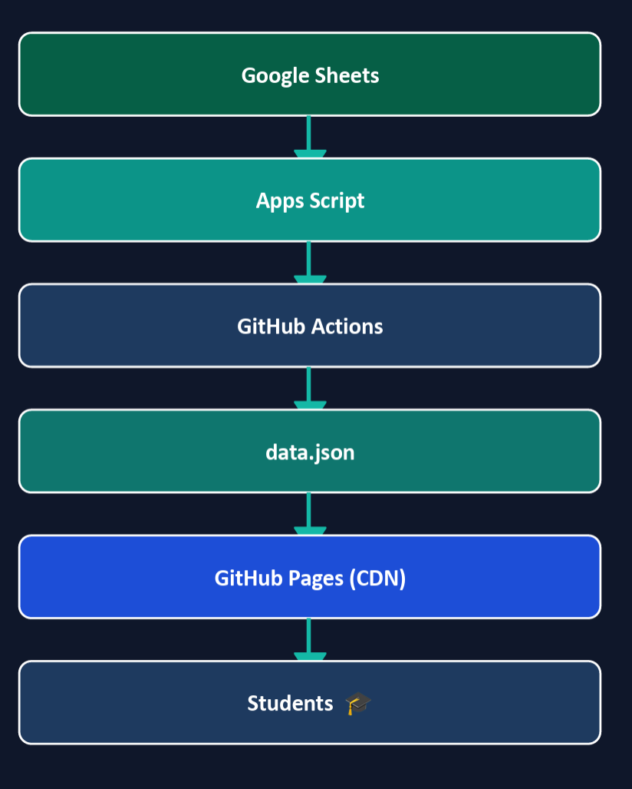

# Developer Guide

Welcome to the Developer Guide for the Edtech Learning Platform. This document provides an overview of the architecture, tech stack, and contribution guidelines.

## Architecture Overview

The platform uses a **Client-Serverless** architecture to minimize hosting costs and simplify data management.

- **Frontend:** Next.js 16+ (App Router)
- **Backend:** Google Apps Script (GAS)
- **Database:** Google Sheets

For a detailed architectural breakdown, please refer to the `ARCHITECTURE.md` file in the root directory.

## Directory Structure

```text
src/
├── app/
│   ├── faculty/       # Faculty/Admin CMS portal routes
│   └── student/       # Student dashboard and learning routes
├── components/
│   ├── faculty/       # Faculty-specific components
│   ├── student/       # Student-specific components
│   └── ui/            # Reusable Shadcn UI components
├── lib/               # Utility functions (e.g., apiClient.ts)
```

## State Management and Data Fetching

### `fetchGAS` Utility
All network requests are handled by `src/lib/apiClient.ts` through the `fetchGAS` function. It communicates via `POST` requests to bypass URL length limits and uses `Content-Type: text/plain` to satisfy Google Apps Script CORS requirements.

```typescript
// Example usage:
const response = await fetchGAS("getModules", { subjectId: "123" });
```

### Static Fallback
To ensure high performance for students, if `NEXT_PUBLIC_IS_DEPLOYED` is `true`, `fetchGAS` attempts to load a statically generated `data.json` instead of querying GAS.

## UI and Styling

- **Tailwind CSS v4:** Used for all utility styling.
- **Shadcn UI:** The base component library. Components are located in `src/components/ui`. You can customize them directly.
- **Icons:** We use `lucide-react`.



## Backend Modification (GAS)

The entire backend logic is contained within `GAS_Backend_Code.js`.
When adding a new feature:
1. Add a new action case in the `doPost` switch statement.
2. Implement the handler function (e.g., `handleNewFeature(payload)`).
3. If writing data, remember to call `invalidateCache(sheetName)` to ensure the Next.js frontend gets the updated data on subsequent reads.
4. Copy the updated code to the Apps Script editor and deploy a **New Version**.

## Automated Deployment Pipeline (CI/CD)

The platform leverages GitHub Actions for continuous deployment, ensuring the static frontend remains perfectly in sync with the Google Sheets database.


**Workflow Breakdown:**
1. **Content Update:** Faculty edits content in the CMS and triggers a deployment.
2. **GAS Webhook:** `handleTriggerDeploy()` in `GAS_Backend_Code.js` fires a `POST` request to the GitHub API using a Personal Access Token (`GITHUB_PAT`), dispatching a custom event.
3. **Static Generation:** The GitHub Action (`.github/workflows/deploy.yml`) starts the Next.js build process. `fetchGAS` retrieves the latest data and caches it into `data.json`.
4. **Hosting:** The fully static application is published. This architecture guarantees maximum performance and zero cost for the frontend hosting.