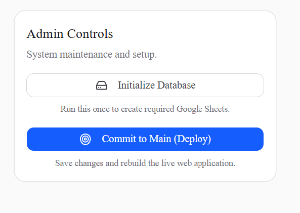

# Faculty Guide

Welcome to the Faculty portal. This dashboard acts as your Content Management System (CMS) where you can build, manage, and deploy courses for students.

## Accessing the Dashboard
Navigate to `/faculty` in your browser. This is your command center.

## 1. Managing Subjects & Modules

The curriculum is structured hierarchically: **Subjects -> Modules -> Subtopics**.

- **Create a Subject:** Click on "Add Subject". Provide a title and description.
- **Add Modules:** Within a subject, you can add multiple modules (chapters).
- **Subtopics:** Inside modules, you can create specific lessons, flashcards, or quizzes.
  - **Text Lessons:** You can directly type or paste text content when creating lessons. Note: Markdown format is supported and will be automatically formatted for students.
  - **Embedded Media:** The "Did You Know" sections now support embedding external media (like videos) to enhance the learning experience.
  - **Visible to Students Option:** You can toggle visibility for individual subtopics. This allows you to draft content and only make it visible to students when you are ready.
  - **Tip:** You can use [NotebookLM](https://notebooklm.google.com/) to generate the content, and to remove any notebooklm watermark use this website: [NotebookLM Watermark Remover](https://notebooklmremover.com/en).
## 2. Creating Content Types

### Flashcards
You can create interactive flashcards for students to review.
1. Navigate to the desired module.
2. Select **Add Flashcard Deck**.
3. You can either create cards manually or upload a `.csv` file. 
   - **Tip:** You can easily generate flashcard CSVs using the [NotebookLM Flashcards Exporter](https://chromewebstore.google.com/detail/notebooklm-flashcards-exp/gfpdgeimnjeibphkimmeeigedjffdnnp) extension. If your generated content has a watermark, you can remove it using [NotebookLM Watermark Remover](https://notebooklmremover.com/en).
4. The system will parse the `.csv` and instantly generate the deck.

### Quizzes
Assess student knowledge with timed quizzes.
1. Select **Add Quiz**.
2. Define the quiz parameters (Time limit, passing score).
3. Add multiple-choice questions.
   - **Tip:** You can generate a CSV of questions using the [NotebookLM Quiz Exporter](https://chromewebstore.google.com/detail/notebooklm-quiz-exporter/pndhmfhdeoiekihofmklndionkfabbdm) extension. Ensure that the "hints" button is unclicked before downloading the CSV. If your generated content has a watermark, you can remove it using [NotebookLM Watermark Remover](https://notebooklmremover.com/en). 

## 3. Content Matrix

The **Content Matrix** gives you a bird's-eye view of all the resources mapped to your course. It allows you to:
- Easily track the progression of topics, quizzes, flashcards, and resources mapped to each module.
- Audit your curriculum to ensure all required learning materials and references are present.
- View visibility statuses for different subtopics at a glance.

## 4. Data Storage (Google Sheets)

Because the system uses Google Sheets as a backend, all your data is safely stored in a spreadsheet you can access anytime.
*Any changes made to the sheet directly will not reflect in the front end or even not show up at all, all the changes must be made form the faculty dashboard only.*
*Warning: Do not change the column headers or the sheet names, as this will break the connection.*

## 5. Deploying Updates

Once you have finished adding or modifying content:
1. The platform will automatically sync changes to the database.
2. If the deployment trigger is configured, you can click the **Deploy to Production** button. This uses a GitHub Action to rebuild the student portal with your latest content, ensuring students get lightning-fast page loads.

