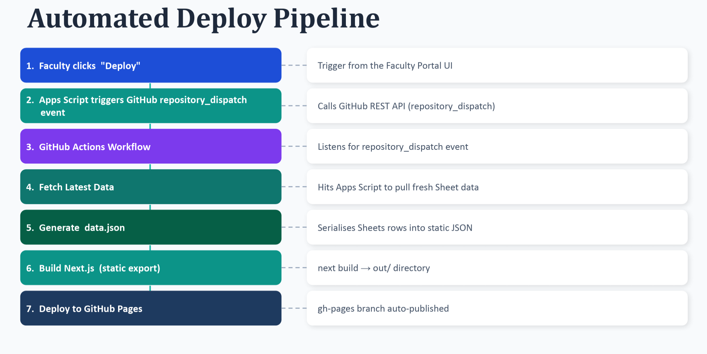

# Installation Guide

This guide will walk you through setting up the Edtech Learning Platform locally and deploying the backend.

## Prerequisites
- Node.js (v18 or higher recommended)
- npm or yarn
- A Google Account (for Google Sheets and Apps Script)

## 1. Local Project Setup

1. **Clone the repository:**
   ```bash
   git clone <your-repository-url>
   cd "UI_NEW_Learning_Platform"
   ```

2. **Install dependencies:**
   ```bash
   npm install
   ```

## 2. Backend Setup (Google Apps Script)

The backend runs entirely on Google Apps Script (GAS) using Google Sheets as a database.

1. Go to [Google Apps Script](https://script.google.com/) and create a **New Project**.
2. Name the project (e.g., "Edtech Backend").
3. Copy the entire contents of `GAS_Backend_Code.js` from the repository and paste it into the GAS editor (`Code.gs`).
4. **Initial Setup:** Run the `setupDatabase()` function from the GAS editor. This will automatically create a new Google Sheet with all the necessary tabs (Subjects, Modules, Subtopics, Quizzes, etc.).
5. **Deploy the Web App:**
   - Click **Deploy** > **New deployment** in the top right.
   - Select **Web app** as the type.
   - Set **Execute as** to `Me`.
   - Set **Who has access** to `Anyone`.
   - Click **Deploy** and authorize the necessary permissions.
   - Copy the generated **Web app URL**.


## 3. Environment Variables

Create a `.env.local` file in the root of the project and add the following variables:

```env
# The URL you copied from the Google Apps Script deployment
NEXT_PUBLIC_GAS_URL=https://script.google.com/macros/s/YOUR_SCRIPT_ID/exec

# Set to true for production, false for local development
NEXT_PUBLIC_IS_DEPLOYED=false
```

## 4. Running the Application

Start the Next.js development server:

```bash
npm run dev
```

Open your browser and navigate to `http://localhost:3000`. You can access the student portal at `/student` and the admin/faculty portal at `/faculty`.

## 5. Deployment & GitHub Pipeline

You can deploy the Next.js frontend to platforms like Vercel or GitHub Pages. The backend includes a webhook trigger for GitHub Actions to automatically redeploy static builds when curriculum content is updated by faculty.



**How the Pipeline Works:**
1. **Trigger:** When faculty updates content (like adding a quiz or flashcard) and hits "Deploy to Production" from the faculty dashboard, Google Apps Script sends a `repository_dispatch` event to GitHub.
2. **Action:** A GitHub Actions workflow (defined in `.github/workflows/deploy.yml`) is triggered.
3. **Build:** Next.js fetches the latest data from the Google Apps Script API and statically generates the student portal (`next build`).
4. **Deploy:** The newly built static files are deployed to GitHub Pages (or another configured host), giving students instant access to the latest content with zero database latency.
